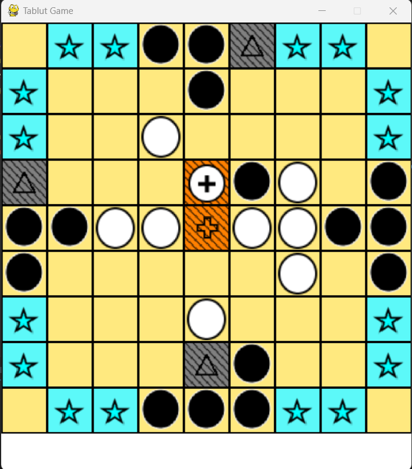
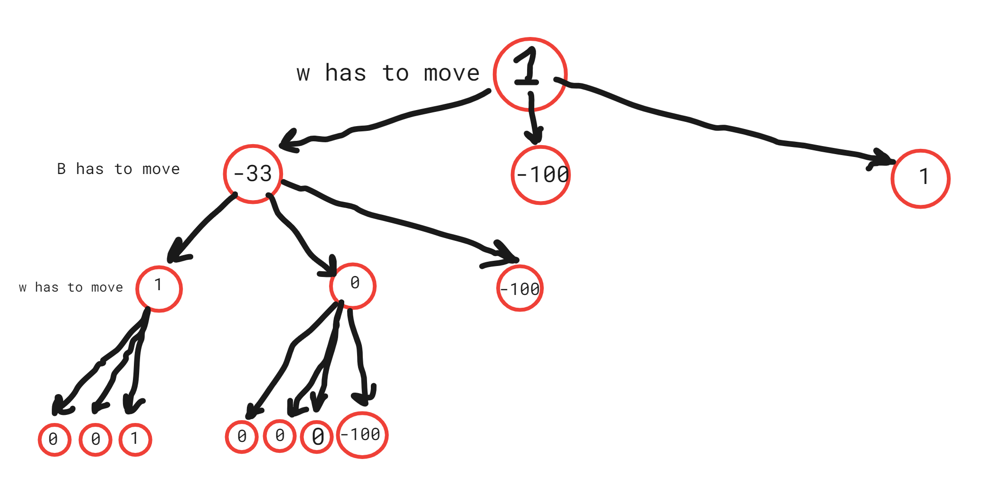
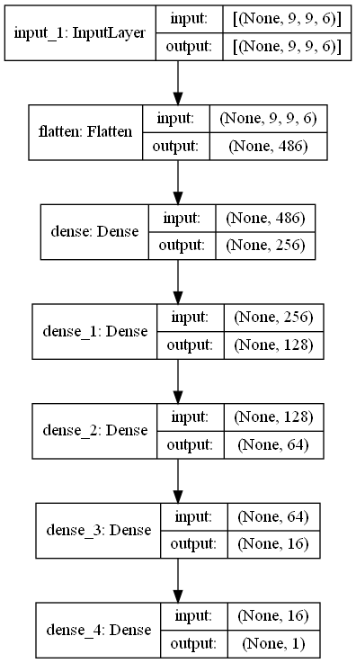

# Tablut AI



This repository aims to create an AI solution for the Tablut board game, specifically for the competition held in University of Bologna's "FUNDAMENTALS OF ARTIFICIAL INTELLIGENCE Module 1" course. You can read about this board game and its rules [HERE](http://tafl.cyningstan.com/page/170/tablut) or play the game using this repo.

The goal is to implement an AI solution capable of winning the game, playing as either Black or White. 

## Our Strategy

There are various AI algorithms to consider for this AI agent. Genetic Algorithms are computationally expensive due to the need for a population of agents playing the game. Neural Nets, while feasible given a dataset of previous games, lack a logical understanding of the game's rules, making sole reliance on them unwise. A* Search can be used, but does not guarantee the best solution, because it heavily relies on the heuristic defined by us and trying to choose the solution that best satisfies that heuristic, but defining a heuristic can be challenging. Simple heuristics like piece counting or king distance to escape tiles may not directly correlate with winning, as our algorithm suggests later on.

Our strategy involves a hybrid of a tree search algorithm we called Mean-Max, with a strong NeuralNet. 

## Mean-Max Tree

(This image is intended to give an idea of this tree, remember that the actuall tree is made from tens of thousands of game states.)

Traditional Min-Max and Alpha-Beta pruning methods  cannot be used in this problem as the opponent is a random player and may not choose the best moves that benefits it. We adopt a probabilistic approach to choose the step that has the MOST probability of ending up winning the game.

Imagine playing as White against a Black player making random moves. The white chooses the best move that is possible, so everytime we expand a node that is playable by white, we give that node the maximum score of its children. Black however, gets the mean score of it’s children, as it may choose any move randomely. This scoring propagates from children to parent nodes until the root node. 

For every game state where White wins, it receives a score of 1, and for every state where White loses, it receives a score of -100. These values define the agent's "risk-taking factor". For instance, if White has two moves: A (score 0) and B (with 100 children, one scoring 1, and one -100, and the rest 0). B's score becomes (-100+1)/100 = -0.99. B will never be selected, even though there is only a 1% chance that Black randomly wins from the B state of the game. Setting this number (-100) high, ensures that the agent plays very conservatively and avoids any move that has the slightest chance of losing the game, even though it means that the agent wins the game in more moves needed. The tree has a maximum depth of 3, meaning it will check the possible next 2 moves by white, or black.


## Neural-Net


If the tree doesn't find a winning solution within two moves, the NeuralNet comes into play. The neural net assigns a score to a game state in range [-1,1]. If a game state is more favorable to white, the score will be positive, if it’s more favourable to black, the score is negative.

Each game state is encoded into six 9x9 matrices, representing: 
1. White pieces 
2. Black pieces 
3. King 
4. Castle 
5. Escape tiles 
6. Camp tiles

This representation of the game board is easier for the neural net to reason upon. 

The initial training of this neuralnet is performed using the dataset provided in the project. However, once the full algorithm was developed, it was used to generate more game records and increase the size of dataset to a total of about 40,000 game states. 

To assign a score to each state, we first look who the winner of this game is. In the case of white being the winner, we give each state a value between 0,1 for the states played by white, and a value between -1,0 for the states played by black. The score is given using a linear function. (This method of scoring works, but there are many ways to improve it.) 

While the NeuralNet isn't directly taught the game's rules, relying solely on it for White's moves resulted in a high winning rate, given the relatively straightforward winning condition (positioning the king into one of the escape squares). However, for Black, where winning isn't as straightforward, the tree-based strategy becomes pivotal.

If the agent can't secure a win in two moves using the Mean-Max tree, the NeuralNet guides it toward more favorable states.

## Optimizations

A significant challenge of the competition is the 60 seconds limit to choose a move. So the best algorithm is of no use, if it’s not fast enough and carefully implemented. For this reason, some optimizations have been done that are as important as the algorithm:


- **Siblings Birth Control:** If a winning state is encountered while exploring children nodes, further exploration halts, reducing computational load.
- **Limit Last Moves:** If white is going to win in 2 moves, the last move Must be done by the King. Similarly, if black is going to win, its last move Must by targeted to a square close to the king to capture it. This way we limit the number of possible moves to check in the tree.
- **Prioritizing Moves:** Moves crucial to securing wins are prioritized, potentially achieving winning within the initial depth.
- **TFLite:** The NeuralNet is optimized further using a tflite mode, significantly enhancing its speed.

The average time for the tree to select a state (playing as White):
- No optimization: 64 seconds (likely exceeding the 60 seconds limit)
- With tree optimizations (1, 2, 3): 2.8 seconds

## How to Play

To install the required Python packages, use the provided `requirements.txt` file:

```bash
pip install -r requirements.txt
```
To run the game, use the `TablutGame.py` file. Replace the `PlayMode` in the following code snippet with any of the four modes provided in the `PlayMode` class:

```python
game = TablutGame(
    w_play_mode=PlayMode.agent, 
    b_play_mode=PlayMode.random, 
    save_game_log=False)
```

## Links

- Competition Page: [http://ai.unibo.it/games/boardgamecompetition/tablut](http://ai.unibo.it/games/boardgamecompetition/tablut)
- Dataset (record of 2700 games, including those provided by the competition): [https://drive.google.com/file/d/1dNJRhrwlSehD3J7HTi2qMa7whDqbcBq2/view?usp=sharing](https://drive.google.com/file/d/1dNJRhrwlSehD3J7HTi2qMa7whDqbcBq2/view?usp=sharing)
